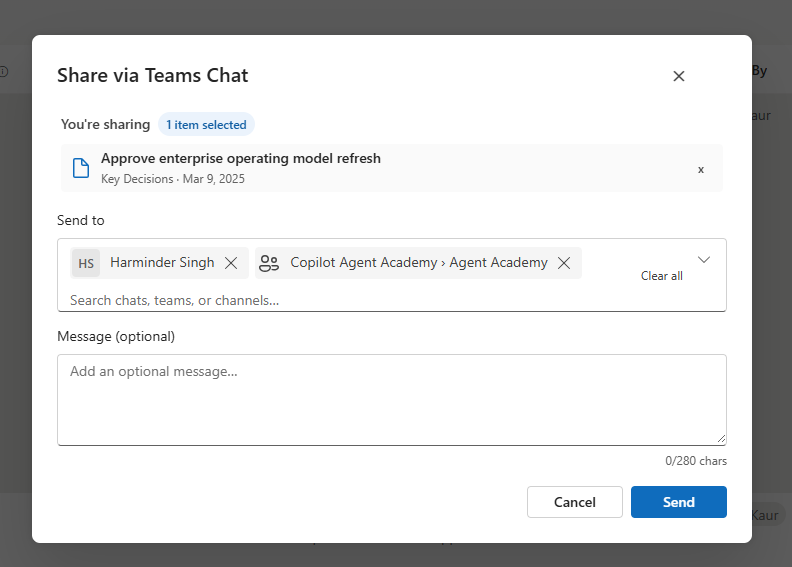

# Share via Teams Chat

## Summary

Share via Teams Chat is a SharePoint Framework list view command set that enables users to send one or more selected SharePoint list items or documents to Microsoft Teams chats and channels as a rich, formatted message with an Adaptive Card.

The solution is designed to make it easy to share contextual SharePoint content with colleagues directly from the list experience without leaving the site.




## Compatibility

This sample is compatible with the following environment configuration:


## Applies to

- [SharePoint Framework](https://learn.microsoft.com/sharepoint/dev/spfx/sharepoint-framework-overview)
- [SharePoint Framework Extensions](https://learn.microsoft.com/sharepoint/dev/spfx/extensions/overview-extensions)
- [List view command sets](https://learn.microsoft.com/sharepoint/dev/spfx/extensions/get-started/building-simple-cmdset-with-dialog-api)
- [Microsoft 365 tenant](https://learn.microsoft.com/sharepoint/dev/spfx/set-up-your-developer-tenant)
- SharePoint Online lists and document libraries

## Contributors

- [Harminder Singh](https://github.com/HarminderSethi)

## Version history

| Version | Date | Comments |
| ------- | ---- | -------- |
| 1.0.0 | July 2, 2026 | Initial sample version |

## Prerequisites

- SharePoint Online tenant
- SharePoint site with a list or document library
- Node.js v22 compatible with SPFx 1.23.0
- Tenant app catalog or site collection app catalog for deployment
- Permissions to install SharePoint Framework solutions
- Microsoft Graph permissions approved by a tenant administrator

## Minimal Path to Awesome

- Clone this repository or download this sample as a ZIP file.
- In the command line, move to the sample folder:

```bash
cd samples/react-share-via-teams-chat-extension
```

- Install dependencies:

```bash
npm install
```

- Start the local debug server:

```bash
npm start
```

- Open the SharePoint workbench and test the command set from a list or library view.

## Features

### Multi-item sharing

Lets users select one or more SharePoint items and send them together to a Teams destination.

### Teams destination selection

Provides a dialog experience for choosing a Teams chat or channel before sending the message.

### Rich message composition

Supports an optional message body and a formatted Adaptive Card that links back to the SharePoint item or document.

### Fluent UI experience

Uses Fluent UI components for a polished, modern dialog experience in SharePoint.

## Supported contexts

The extension is intended for SharePoint Online lists and document libraries where the list view command set can surface the custom action.

## Build and package

To build the project:

```bash
npm run build
```

This produces the SharePoint package in the solution folder for deployment.

## Installation

1. Build the solution package.
2. Upload the generated .sppkg file to the tenant app catalog or a site collection app catalog.
3. Deploy the solution.
4. Navigate to the target SharePoint site.
5. Add the app to the site and confirm the command set is available in list and library views.

## Usage

1. Open a SharePoint list or document library.
2. Select one or more items.
3. Choose Send to Teams from the command bar.
4. Select a Teams chat or channel.
5. Add an optional message.
6. Send the message.

## Permissions used

The solution requests delegated Microsoft Graph permissions for:

- Chat.Read
- Chat.ReadWrite
- Chat.ReadBasic
- ChatMessage.Send
- Team.ReadBasic.All
- Channel.ReadBasic.All
- ChannelMessage.Send

## Privacy and data handling

This sample uses Microsoft Graph from the SharePoint client-side context and does not require a custom backend service.

- The selected SharePoint item information is sent only when a user initiates sharing.
- Sharing a link or message in Teams does not automatically grant the recipient access to the underlying SharePoint item or document.
- The experience relies on delegated permissions that must be approved by a tenant administrator.
- The message content is composed by the user and sent to the chosen Teams destination.

## Known limitations

- The experience depends on the user having access to the target Teams chat or channel.
- Microsoft Graph permissions must be approved before the sample can send messages successfully.
- The sample is intended for SharePoint Online and relies on the modern command bar experience.

## References

- [SharePoint Framework overview](https://learn.microsoft.com/sharepoint/dev/spfx/sharepoint-framework-overview)
- [Build your first list view command set](https://learn.microsoft.com/sharepoint/dev/spfx/extensions/get-started/building-simple-cmdset-with-dialog-api)
- [Microsoft Graph permissions reference](https://learn.microsoft.com/graph/permissions-reference)
- [PnPjs documentation](https://pnp.github.io/pnpjs/)

## Disclaimer

THIS CODE IS PROVIDED AS IS, WITHOUT WARRANTY OF ANY KIND, EITHER EXPRESS OR IMPLIED, INCLUDING ANY IMPLIED WARRANTIES OF FITNESS FOR A PARTICULAR PURPOSE, MERCHANTABILITY, OR NON-INFRINGEMENT.

## Help

We do not support samples directly, but the community is always willing to help. If you run into issues, please use the GitHub issues for this sample repository to report them or ask questions.

You can try looking at [issues related to this sample](https://github.com/pnp/sp-dev-fx-extensions/issues?q=react-share-via-teams-chat-extension) to see if anybody else is having the same issues.

You can also try looking at [discussions related to this sample](https://github.com/pnp/sp-dev-fx-extensions/discussions?discussions_q=react-share-via-teams-chat-extension) and see what the community is saying.

If you encounter any issues while using this sample, [create a new issue](https://github.com/pnp/sp-dev-fx-extensions/issues/new?assignees=&labels=Needs%3A+Triage+%3Amag%3A%2Ctype%3Abug-suspected&template=bug-report.yml&sample=react-share-via-teams-chat-extension&authors=@Harminder_Sethi&title=react-share-via-teams-chat-extension%20-%20).

For questions regarding this sample, [create a new question](https://github.com/pnp/sp-dev-fx-extensions/issues/new?assignees=&labels=Needs%3A+Triage+%3Amag%3A%2Ctype%3Aquestion&template=question.yml&sample=react-share-via-teams-chat-extension&authors=@Harminder_Sethi&title=react-share-via-teams-chat-extension%20-%20).

Finally, if you have an idea for improvement, [make a suggestion](https://github.com/pnp/sp-dev-fx-extensions/issues/new?assignees=&labels=Needs%3A+Triage+%3Amag%3A%2Ctype%3Aenhancement&template=suggestion.yml&sample=react-share-via-teams-chat-extension&authors=@Harminder_Sethi&title=react-share-via-teams-chat-extension%20-%20).


